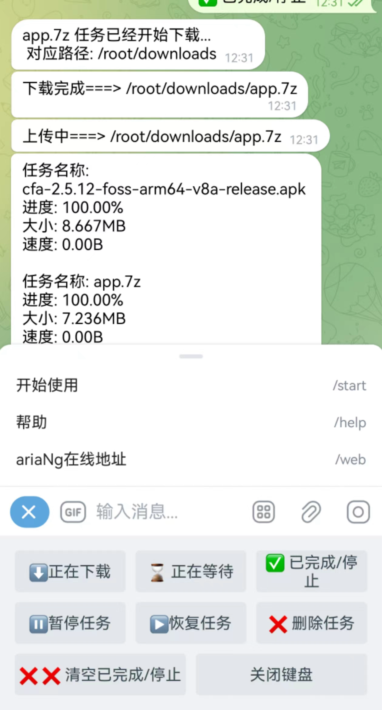

# MistRelay

基于Telegram机器人的aria2下载控制系统，支持OneDrive自动上传

### 特点

1. 基于电报机器人控制aria2，可自行设置下载完成后的处理方式
2. 支持下载完成后通过rclone自动上传到OneDrive
3. 支持`批量`添加http、磁力、种子下载
4. 支持自定义目录下载，使用 /path 命令设置
5. 自己实现`aria2c` `jsonrpc`调用，增加断开重连功能
6. 命令 /web 获取在线ariaNg web控制地址，方便跳转
7. 下载实时进度、上传实时进度显示
8. Docker一键部署，集成aria2和rclone

### 如何安装

#### 1. 配置文件设置

重命名 `db/config.example.yml` 为 `config.yml` 并设置参数：

```yaml
API_ID: xxxx                      # Telegram API ID
API_HASH: xxxxxxxx                # Telegram API Hash
BOT_TOKEN: xxxx:xxxxxxxxxxxx      # Telegram Bot Token
ADMIN_ID: 管理员ID                 # 管理员的Telegram ID
FORWARD_ID: 文件转发目标id          # 可选，文件转发目标ID

# 上传设置
UP_TELEGRAM: false                # 是否上传到电报
UP_ONEDRIVE: true                 # 是否启用rclone上传到OneDrive

# rclone配置
RCLONE_REMOTE: onedrive           # rclone配置的远程名称
RCLONE_PATH: /Downloads           # OneDrive上的目标路径

# aria2c设置
RPC_SECRET: xxxxxxx               # RPC密钥
RPC_URL: xxxxxx:6800/jsonrpc      # RPC地址

# 代理设置（可选）
PROXY_IP:                         # 代理IP，不需要则留空
PROXY_PORT:                       # 代理端口，不需要则留空
```

#### 2. 配置rclone

将rclone配置文件（rclone.conf）放入项目的rclone目录中：

```bash
# 如果还没有rclone目录，先创建一个
mkdir -p rclone

# 安装rclone（如果尚未安装）
curl https://rclone.org/install.sh | sudo bash

# 配置rclone
rclone config

# 将生成的配置文件复制到项目的rclone目录
cp ~/.config/rclone/rclone.conf ./rclone/
```

#### 3. 使用Docker部署

安装Docker和Docker Compose：

```bash
curl -fsSL get.docker.com -o get-docker.sh && sh get-docker.sh && systemctl enable docker && systemctl start docker
```

下载项目到本地：

```bash
git clone https://github.com/Lapis0x0/MistRelay.git
cd MistRelay
```

构建并启动容器：

```bash
docker compose up -d --build
```

查看日志：

```bash
docker compose logs -f --tail=4000
```

### 使用方法

1. 在Telegram中找到您的机器人并发送 `/start` 命令
2. 使用 `/help` 查看帮助信息
3. 发送HTTP链接、磁力链接或种子文件开始下载
4. 使用菜单按钮管理下载任务
5. 使用 `/path` 命令设置下载目录
6. 使用 `/web` 命令获取ariaNg在线控制地址

### 命令列表

- `/start` - 开始使用
- `/help` - 查看帮助
- `/info` - 查看系统信息
- `/web` - 获取ariaNg在线地址
- `/path [目录]` - 设置下载目录

### 菜单功能

- ⬇️正在下载 - 查看正在下载的任务
- ⌛️ 正在等待 - 查看等待中的任务
- ✅ 已完成/停止 - 查看已完成或停止的任务
- ⏸️暂停任务 - 暂停选中的任务
- ▶️恢复任务 - 恢复选中的任务
- ❌ 删除任务 - 删除选中的任务
- ❌ ❌ 清空已完成/停止 - 清空所有已完成或停止的任务

### 应用截图

/help 查看帮助



### 灵感来源

https://github.com/HouCoder/tele-aria2

https://github.com/jw-star/aria2bot
